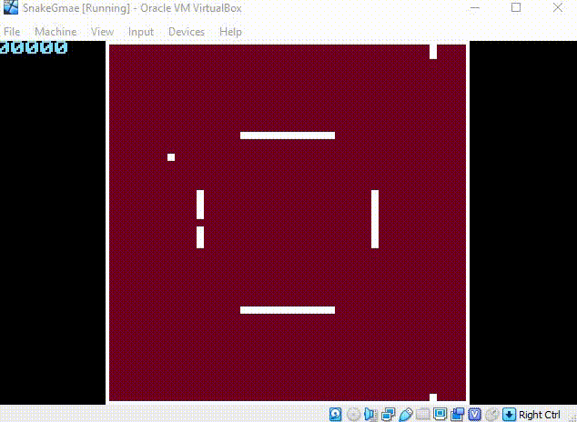

# Snake-Game-x86-assembly

### x86 assembly Snake Game, which uses nasm syntax, this game runs on bare machine and does not require any operating system

#### the project contains the following folders: 

*  core folder which contains the main functionality of the game 
*  graphics folder which contains functions that were uses to draw the game screen frames 
*  vhd folder contains vhd (Virtual Hard Disk) image, you can use to try the game 
### 	   [use it with vmware of virtual box]
*  loader folder which is used to overcome 512 byte limit of the mbr 
*  main.asm file: the file which the game starts from 

## demo

